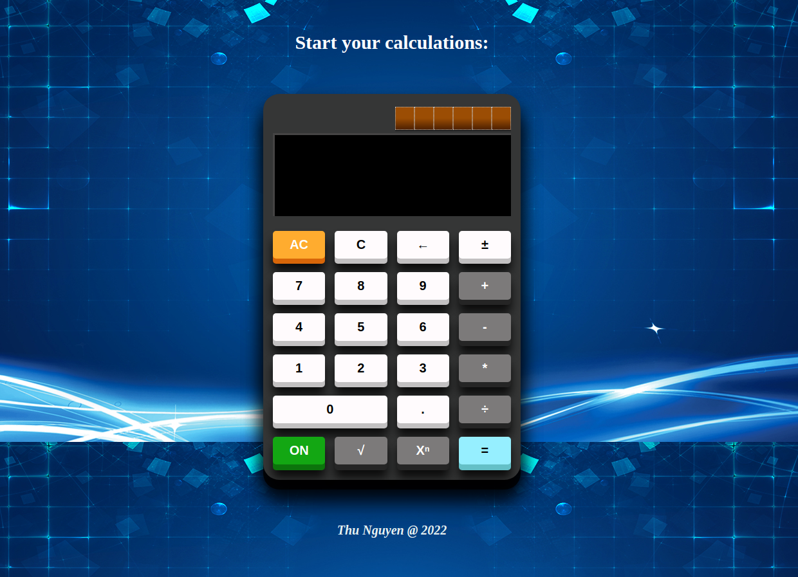

A project made using CSS, HTML & JavaScript as part of The Odin Project.

<h2><u>Objective</u></h2>
<ol>
  <li>Users should be able to string together several operations and get the right answer, with each pair of numbers being evaluated at a time. For example, 12 + 7 - 5 * 3 = should yield 42.</li>
  <li>Your calculator should not evaluate more than a single pair of numbers at a time. </li>
  <li>You should round answers with long decimals so that they don’t overflow the screen.</li>
  <li>Pressing “clear” should wipe out any existing data.. make sure the user is really starting fresh after pressing “clear”</li>
  <li>Display a snarky error message if the user tries to divide by 0… and don’t let it crash your calculator!</li>
</ol>
 
<h3><u>Live Preview:</u></h3> 
 
 
<h3><u>Repo:</u></h3> <a href="https://github.com/telshira/calculator">https://github.com/telshira/calculator</a>
 
 
Background Img Source: 
<a href="https://pngtree.com/freebackground/blue-lines-futuristic-technology-background_955818.html">https://pngtree.com/freebackground/blue-lines-futuristic-technology-background_955818.html</a>